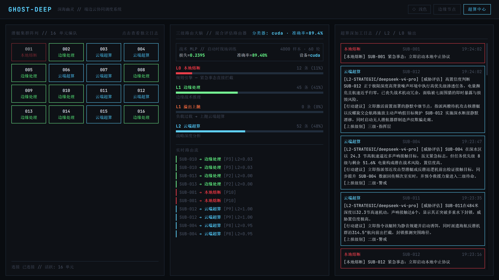
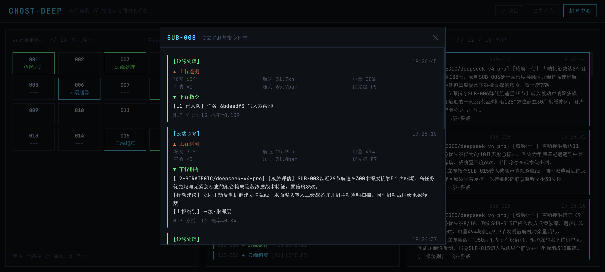
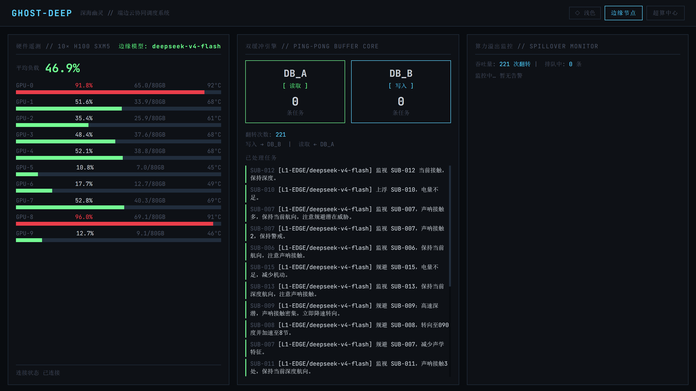
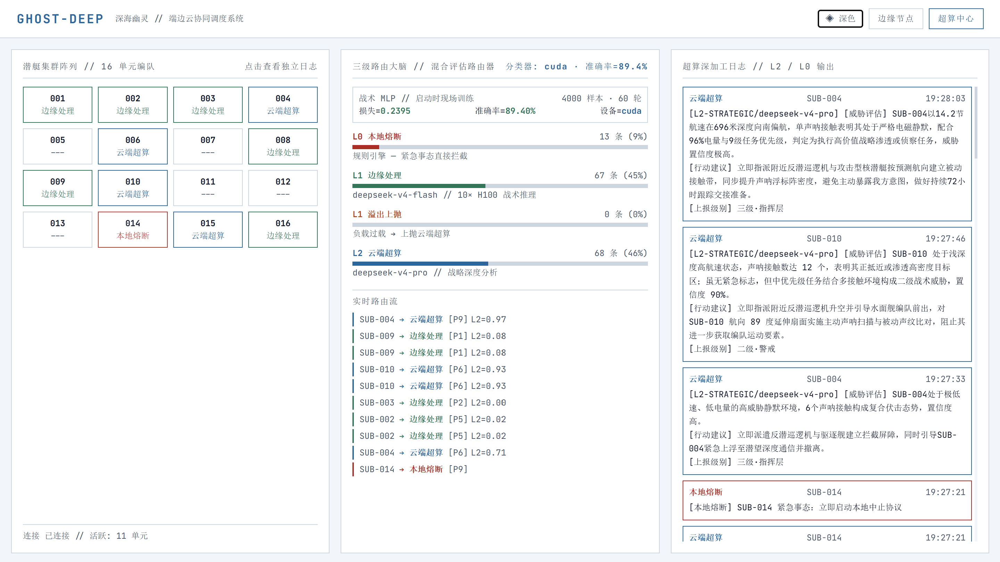
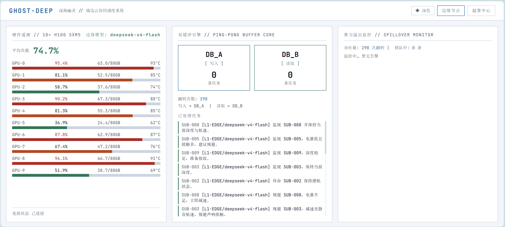

# GHOST-DEEP · 深海幽灵

[](https://www.python.org/)
[](https://fastapi.tiangolo.com/)
[](https://react.dev/)
[](https://pytorch.org/)
[](./LICENSE)

> 基于端-边-云协同与多级算力路由的潜艇集群调度系统
> ——  江苏海洋大学分布式与云计算课程作业

---

## 目录

- [架构概览](#架构概览)
- [核心机制](#核心机制)
- [技术栈](#技术栈)
- [项目结构](#项目结构)
- [快速启动](#快速启动)
- [API 参考](#api-参考)
- [负载溢出演示](#负载溢出演示)
- [多视角指挥舱](#多视角指挥舱)
- [开发说明](#开发说明)

---

## 架构概览

```
                            ┌─────────────────────────┐
   SUB-001 ─┐               │     陆地数据中心 (L2)      │
   SUB-002 ─┤               │   DeepSeek-v4-pro       │
     ...    ─┤               │   超算级别 · 战略统筹     │
   SUB-016 ─┘               └──────────┬──────────────┘
       │                                │
       │  遥测上行                      │  溢出上抛 / L2 路由
       │                                │
       ▼                                │
┌──────────────────────────────────────────────────────────────┐
│                    水面母舰 · 边缘节点 (L1)                     │
│                      10× H100 SXM5                           │
│                                                              │
│  ┌──────────┐    ┌──────────────┐    ┌──────────────────┐   │
│  │ L0 规则   │───▶│ MLP 分类器    │───▶│ 算力溢出监控       │   │
│  │ 紧急拦截   │    │ L1/L2 智能分流 │    │ GPU > 85% → 上抛  │   │
│  └──────────┘    └──────┬───────┘    └──────────────────┘   │
│                         │                                    │
│                         ▼                                    │
│              ┌──────────────────┐                            │
│              │  Ping-Pong DB     │                            │
│              │  DB_A  ⇄  DB_B   │                            │
│              │  3s 翻转 · 读写分离 │                            │
│              └──────────────────┘                            │
└──────────────────────────────────────────────────────────────┘
```

**三级路由决策链：**

```
潜艇遥测 → L0 规则引擎 → L1/L2 MLP 分类器 → 溢出检查 → { L1 边缘 | L2 云端 | L1 溢出上抛 }
```

---

## 核心机制

### 1. L0 规则引擎 — 本地熔断

纯硬编码 `if-else`，零网络依赖，零模型延迟。触发条件：

| 条件 | 动作 |
|---|---|
| `emergency == True` | 立即启动本地中止协议 |
| `battery_pct < 8%` | 立即返航 (RTB) |
| `hull_pressure > 85 bar` | 紧急上浮 |

这是分布式系统中的 **Circuit Breaker** 模式——生死攸关的决策完全本地化，不依赖外部服务。

### 2. MLP 分类器 — 智能分流

启动时使用 **PyTorch** 在 GPU（无卡则 CPU）上现场训练一个 2 层 MLP：

- 合成 4000 条历史遥测样本（6 维特征 × 加权打分标签）
- 训练 60 轮，batch size 256
- 训练权重持久化至 `backend/data/classifier.pt`，二次启动秒级加载

每条遥测实时推理，输出 L2 概率 → 概率 ≥ 0.5 则路由至云端 L2。

### 3. 算力溢出 — 动态负载均衡

`SpilloverMonitor` 持续模拟 10 张 H100 的负载波动（每 0.5s 随机漂移 ±4%）。当平均负载超过 **85%** 阈值：

- 本应路由至 L1 的任务被标记为 `L1-ESCALATED`
- 自动上抛至云端 L2 处理
- 前端边缘节点视图红色告警 + 云端超算日志刷屏

这是分布式系统中最核心的 **动态任务迁移** 模式。

### 4. 双缓冲引擎 — 读写分离

```
       ┌─────────┐        ┌─────────┐
  t₀   │ DB_A    │ 写入   │ DB_B    │ 空闲
       └─────────┘        └─────────┘
               │ 3s 翻转 │
       ┌─────────┐        ┌─────────┐
  t₁   │ DB_A    │ 读取   │ DB_B    │ 写入
       └─────────┘        └─────────┘
```

- `active_write_db` 指针每 3 秒翻转
- 写入方（16 艘潜艇高频上报）与读取方（AI 模型慢速推理）完全解耦
- 后台协程遍历只读库，调用 DeepSeek-v4-flash 产出战术指令

### 5. 每潜艇独立日志

16 艘潜艇各自拥有独立的遥测上行 + 指令下行历史。点击阵列中的任意潜艇即可查看其完整数据链路——每条潜艇都是独立的分布式节点。

---

## 技术栈

| 层 | 技术 |
|---|---|
| 后端框架 | Python 3.12 / FastAPI / Uvicorn |
| 实时通信 | WebSocket (每 0.5s 推送遥测) |
| AI 推理 | DeepSeek-v4-flash (L1 边缘) / DeepSeek-v4-pro (L2 云端) |
| 机器学习 | PyTorch 2.4 / NumPy (MLP 分类器) |
| 前端框架 | React 18 / TypeScript |
| UI | Tailwind CSS / React Router v6 |
| 主题 | CSS 变量驱动的深色/浅色双主题 |
| 协议 | OpenAI-compatible API (via right.codes proxy) |

---

## 项目结构

```
ghost-deep/
├── backend/
│   ├── main.py                   # FastAPI 入口 + 路由注册
│   ├── requirements.txt          # Python 依赖
│   ├── .env                      # API Key / 模型配置 (不入库)
│   ├── core/
│   │   ├── evaluator.py          # 三级路由主引擎 (L0/L1/L2)
│   │   ├── classifier.py         # MLP 分类器训练 + 预测 + 持久化
│   │   ├── spillover.py          # GPU 负载模拟 + 溢出判定
│   │   ├── ping_pong_db.py       # 双缓冲引擎
│   │   ├── data_generator.py     # 潜艇遥测数据生成器
│   │   └── prompts.py            # L1/L2 系统提示词集中管理
│   ├── api/
│   │   └── websocket.py          # WebSocket 连接管理 + 数据管道
│   ├── tests/
│   │   └── test_api_smoke.py     # API 冒烟测试 (模型列表 + 真实调用)
│   └── data/                     # 运行时生成 (不入库)
│       └── classifier.pt         # 训练好的分类器权重
├── frontend/
│   ├── index.html
│   ├── package.json
│   ├── tailwind.config.js        # 主题色定义 (CSS 变量)
│   ├── vite.config.ts            # Vite + API 代理
│   └── src/
│       ├── main.tsx              # React 入口
│       ├── App.tsx               # 路由 + 导航 + 主题切换
│       ├── index.css             # 深色/浅色主题变量
│       ├── hooks/
│       │   └── useWebSocket.ts   # WebSocket + REST API hooks
│       └── pages/
│           ├── CenterView.tsx    # 超算中心大屏
│           └── NodeView.tsx      # 边缘节点监控
├── README.md
├── CLAUDE.md                     # AI 开发指令
└── LICENSE
```

---

## 快速启动

### 前置条件

- Python 3.10+
- Node.js 18+
- PyTorch (自动安装，GPU 可选)

### 1. 克隆项目

```bash
git clone https://github.com/Liuuoo/---.git
cd ---
```

### 2. 配置环境

```bash
cd backend
cp .env.example .env
```

编辑 `.env`，填入你的 API Key：

```env
# 推荐：DeepSeek 官方 API（获取地址 https://platform.deepseek.com/api_keys）
API_KEY=your_deepseek_api_key_here
DEEPSEEK_BASE_URL=https://api.deepseek.com
L1_MODEL=deepseek-chat
L2_MODEL=deepseek-chat

# 也支持任意 OpenAI 兼容代理（如 right.codes 等）
# DEEPSEEK_BASE_URL=https://your-proxy.com/v1
# L1_MODEL=your-fast-model
# L2_MODEL=your-powerful-model
```

### 3. 启动后端

```bash
cd backend
pip install -r requirements.txt
uvicorn main:app --reload --port 8000
```

看到以下日志即就绪：

```
Classifier loaded from checkpoint: acc=0.XXXX device=cuda
# 或首次启动:
Classifier trained: loss=0.XXXX acc=0.XXXX device=cuda
```

### 4. 启动前端

```bash
cd frontend
npm install
npm run dev
```

### 5. 访问

- `http://localhost:5173/center` — 超算中心全局大屏
- `http://localhost:5173/node` — 边缘节点监控面板

---

## API 参考

### REST

| 方法 | 路径 | 说明 |
|---|---|---|
| `GET` | `/health` | 健康检查 |
| `GET` | `/api/classifier` | 分类器训练报告 (device / accuracy / loss) |
| `GET` | `/api/models` | 当前使用的 L1 / L2 模型铭牌 |
| `GET` | `/api/sub/{sub_id}/log?n=30` | 指定潜艇的遥测与指令日志 |
| `POST` | `/api/spike?duration=5` | 触发 GPU 负载尖峰 (演示溢出) |

### WebSocket

| 路径 | 推送内容 | 频率 |
|---|---|---|
| `/ws/center` | `center_telemetry` (路由统计 + 事件日志) / `route_event` (每条路由结果) | 每 0.4s |
| `/ws/node` | `node_telemetry` (10×GPU 遥测 + 双缓冲状态) / `alert` (L0/L1 溢出告警) | 每 0.5s |

### API 冒烟测试

验证模型端点与 Key 可用：

```bash
cd backend
python -m tests.test_api_smoke
```

输出示例：

```
[DEEPSEEK] 2 models: ['deepseek-v4-flash', 'deepseek-v4-pro']
[L1 / deepseek-v4-flash]  (2.7s)
  → 规避 SUB-007；电池电量低且声呐接触多…
[L2 / deepseek-v4-pro]  (22.5s)
  → [威胁评估] 高置信度：SUB-007 处于极限深度…
```

---

## 负载溢出演示

### 方式一：API 触发（推荐）

```bash
# 触发 5 秒尖峰
curl -X POST "http://localhost:8000/api/spike?duration=5"

# 连续触发模拟持续过载
for i in $(seq 1 5); do
  curl -X POST "http://localhost:8000/api/spike?duration=3"
  sleep 1
done
```

### 方式二：Python 脚本

```python
import httpx, asyncio

async def stress():
    async with httpx.AsyncClient() as c:
        for _ in range(10):
            await c.post("http://localhost:8000/api/spike?duration=3")
            await asyncio.sleep(0.5)

asyncio.run(stress())
```

### 预期效果

| 视图 | 可观察现象 |
|---|---|
| `/node` 左栏 | 10 张 GPU 负载全部飙至 90%+，平均负载数字变红 |
| `/node` 中栏 | 双缓冲翻转频率加快，写入量暴涨 |
| `/node` 右栏 | 红色告警框 `[警告] GPU 负载严重`，溢出日志刷屏 |
| `/center` 中栏 | `L1 溢出上抛` 统计条从 0% 开始增长 |
| `/center` 右栏 | L2 云端深度分析日志密集涌入 |

---

## 多视角指挥舱

### `/center` — 超算中心全局大屏

```
┌──────────────┬────────────────┬──────────────────┐
│ 潜艇集群阵列   │ 三级路由大脑     │ 超算深加工日志     │
│ (16 单元编队) │                │ (L2/L0 输出)     │
│              │ 分类器训练铭牌   │                  │
│ 点击任意潜艇   │ L0/L1/L2 占比   │ 可滚动           │
│ → 独立日志弹窗 │ 实时路由流      │ 自动刷新          │
└──────────────┴────────────────┴──────────────────┘
```

### `/node` — 边缘节点监控面板

```
┌──────────────┬────────────────┬──────────────────┐
│ 硬件遥测      │ 双缓冲引擎       │ 算力溢出监控       │
│ 10×H100 GPU  │ DB_A ⇄ DB_B   │ 吞吐量 + 告警     │
│              │                │                  │
│ 负载进度条    │ 翻转动画        │ > 85% 红色警告    │
│ VRAM / 温度   │ 已处理任务      │ 异常日志          │
└──────────────┴────────────────┴──────────────────┘
```

---

## 开发说明

### 提示词调优

L1 / L2 模型提示词集中存放在 `backend/core/prompts.py`，支持热重载（`uvicorn --reload`）：

- `L1_SYSTEM_PROMPT` — 边缘战术 AI 的系统角色
- `L2_SYSTEM_PROMPT` — 云端战略 AI 的系统角色
- `l1_user_prompt()` / `l2_user_prompt()` — 用户消息模板

### 分类器重新训练

删除权重文件即可：

```bash
rm backend/data/classifier.pt
# 重启后端，自动重新训练
```

### 深色/浅色主题

- 导航栏「◇ 浅色」按钮一键切换
- 偏好存入 `localStorage`，跨会话保持
- CSS 变量定义在 `frontend/src/index.css`

### 技术决策

| 决策 | 原因 |
|---|---|
| Mock 硬件遥测 | 演示环境无真实 GPU，用 `asyncio.sleep` + 随机漂移模拟 |
| OpenAI 兼容协议 | 通过 right.codes proxy 统一接入 DeepSeek 模型 |
| Ping-Pong DB 用内存字典 | 演示双缓冲概念，生产环境可替换为 Redis / Kafka |
| 分类器用 MLP 而非规则 | 展示"现场训练"这一核心卖点 |
| 时间戳用本地时间 | 答辩现场更直观 |

---

## 界面截图

### 超算中心全局大屏 `/center`



*① 潜艇集群阵列（16 单元编队，按路由着色，点击弹出独立日志）② 三级路由大脑（分类器训练铭牌 + L0/L1/L2 分流占比） ③ 超算深加工日志（L2 三标签战略分析 + L0 熔断记录，内部滚动）*

### 潜艇独立日志弹窗



*点击任意潜艇弹出，展示该潜艇的 ▲ 上行遥测数据与 ▼ 下行 AI 指令历史*

### 边缘节点监控面板 `/node`



*① 10×H100 GPU 硬件遥测（负载 / VRAM / 温度实时波动） ② Ping-Pong DB 双缓冲引擎（DB_A/DB_B 翻转动画 + 已处理任务列表） ③ 算力溢出监控（吞吐量统计 + 负载 > 85% 红色告警）*

### 浅色模式



*导航栏「◇ 浅色」一键切换，偏好持久化*

### 溢出演示效果



*执行 `curl -X POST /api/spike` 后，GPU 负载飙红，溢出告警框出现，L1-ESCALATED 计数增长*

> **截图指引：** 启动前后端后，打开上述页面，使用浏览器开发者工具模拟 1920×1080 分辨率截取全屏。截图保存至 `docs/screenshots/` 目录。

---

## License

MIT © 2025
